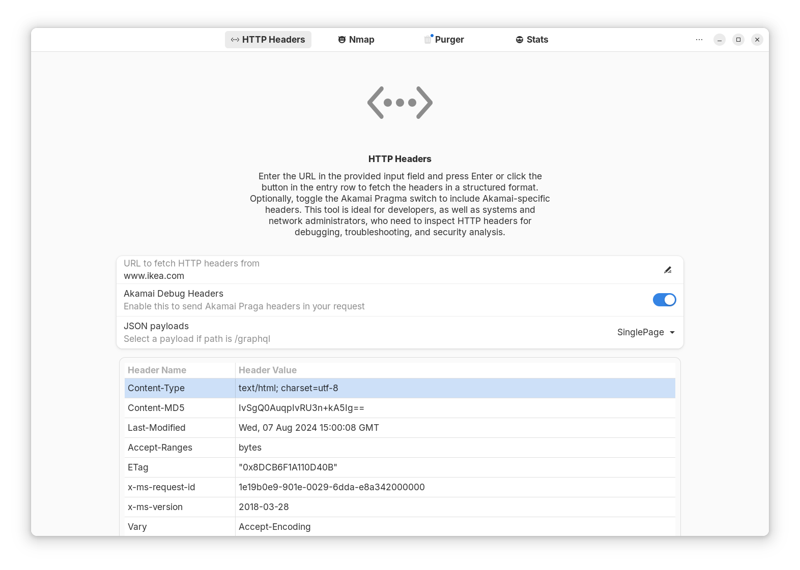

# WebOps Evaluation Suite

WOES is a graphical user interface designed for performing various web operations tasks. Built with GTK 4 and Adwaita, it provides an intuitive and user-friendly interface for tasks such as fetching HTTP headers, performing port scans, and running OS fingerprint detection.

# Features
* Fetch and Display HTTP Headers: Retrieve and view HTTP headers for any given URL, with the ability to enable Akamai debug headers.
* Port Scanning: Perform port scans on specified targets with customizable options, including OS fingerprint detection and NSE scripts.
* OS Fingerprint Detection: Detect operating systems on scanned targets as part of the port scanning process.
* NSE Script Integration: Run Nmap Scripting Engine (NSE) scripts as part of the scanning process.

# Requirements
* `GTK 4` / `libadwaita`
* `GtkSourceView`
* `Python 3`

The following Python libraries are also required: `requests`, `pyYAML`, `python-nmap`

# Development Status
This application is currently in early development. The HTTP Headers and Nmap status pages are functional, with more features planned for future releases.