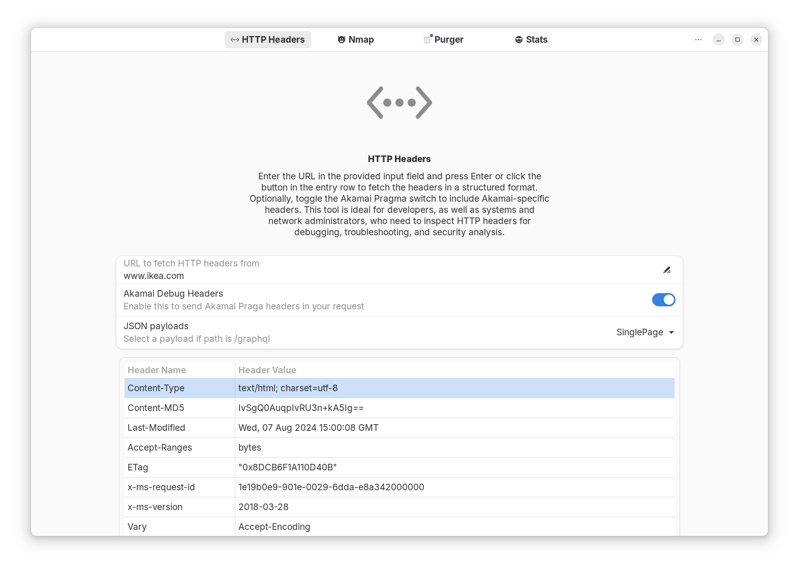

# WebOps Evaluation Suite (WOES)



WOES is a GTK 4/Adwaita GUI for web operations tasks like:
- Fetching HTTP headers (Akamai debug headers supported).
- Port scanning (including OS fingerprinting and NSE scripts).
- DNS lookups (various record types and reverse DNS).

## Requirements

- GTK 4, libadwaita, GtkSourceView
- Python 3
- Python packages: `requests`, `pyYAML`, `python-nmap`, `dnspython`
  ```bash
  pip install requests PyYAML python-nmap dnspython
  ```
- Build tools: `Meson`, `Ninja`
  ```bash
  # Fedora/Red Hat
  sudo dnf install meson ninja-build
  # Debian/Ubuntu
  sudo apt install meson ninja-build
  ```
- For Flatpak builds: `flatpak` (install via your package manager if needed)

## Clone the Repository

Clone the repository:

```bash
> git clone https://github.com/mclellac/woes.git
> cd woes
```

## Build and Install

**Recommended (Meson & Ninja):**
```bash
meson setup build --wipe
ninja -C build --verbose
sudo ninja -C build install --verbose
```

**Alternative (Flatpak):**
```bash
./build-flatpak.py
# Follow instructions in the flatpak directory to install and run.
```

## Development Status
Early development. HTTP Headers, Nmap, and DNS tools are functional. More features planned.
