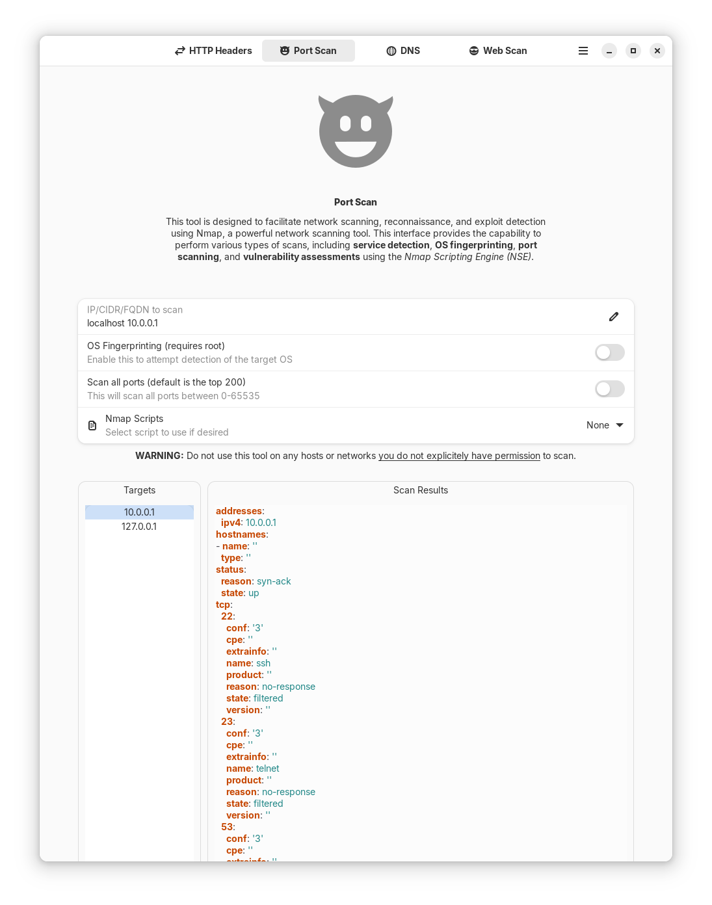

# WebOps Evaluation Suite

A graphical user interface for various web operations tasks, built with GTK 4 and Adw.

# Features

* Fetch and display HTTP headers for a given URL
* Toggle Akamai pragma header for header fetching
* Select JSON payloads from a dropdown menu
* Switch between pages in the application

# Requirements

* GTK 4/ libadwaita
* Python 3
* requests

This is in very early development and not working yet.
